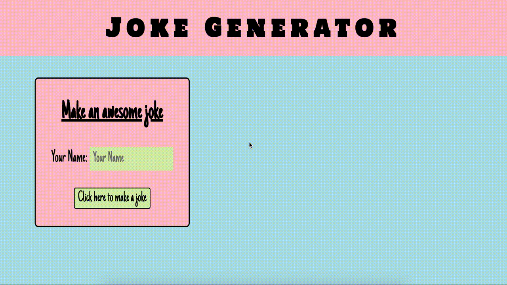

# Debugging Workshop

This app is a simple joke generator. You put your name in and it will automatically generate a joke for you. But OH NO! Our app is full of bugs! It's up to you to debug this app and get it up and running once more.

The below gif demonstrates the intended functionality of this app:

# How to debug

1. Describe the bug:
  a. When I do X
  b. Y happens
  c. But I expected (wanted) Z to happen
2. Form a hypothesis or educated guess about WHY the bug is happening
  a. Read any errors, carefully
  b. Use your past experience with similar bugs to come up with ideas
3. Pick the most likely hypothesis
  a. If you have a reason, a gut feeling, or a favorite, use those to guide you (those factors are listed roughly in order of how well you can rely on them to guide you)
4. Test a hypothesis
  a. If your hypothesis is supported by the results of the tests, continue to 5
  b. If not, try a different hypothesis (or make a new one) until you find a way to explain what's happening
5. ONLY only once you have a tested and supported hypothesis, try a fix based on that hypothesis
  a. If it worked, rejoice!
  b. If it didn't, remove your attempted fix, and go back to 2.

# How to read the README

  Let's understand our deliverables:

  1. When X event happens
    - What event type: click? submit? something spicier?
    - To what element?
    - Is that element on the DOM already or did we slap it there when we completed a previous feature?
    - Should we delegate?
  2. Do Y fetch
    - What HTTP method?
    - What path / URL?
    - What CRUD action are we doing, and to what model? (is it a list or just one?)
    - Where can I get the ID? 
      - Where will be the most convenient place to get an id out of a dataset in my event handler? How can we put one there?
    - What information do I need from the DOM for the request body? (only for create / update)
  3. Slap Z on (off) the DOM
    - Optimistic or pessimistic?
    - Are we creating, reading, updating, or deleting from the DOM?
    - Is it on the DOM already or did we slap it there when we completed a previous feature?
    - Should I traverse (i.e. .parentElement, .nextSibling, .children) to get a DOM element? (blanket no)
    - Can we grab it by ID or querySelector? Is there one of these, or is it an item in a list? (better)
